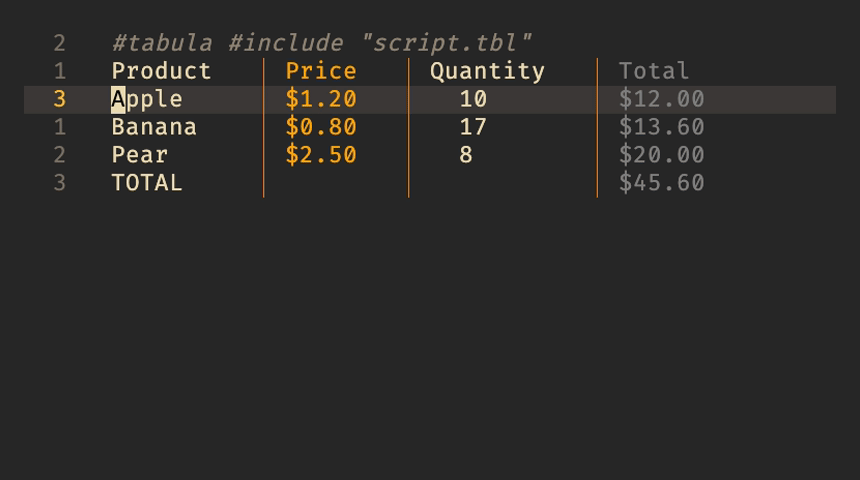

#  Tabula for Visual Studio Code



VS Code extension for [Tabula](https://github.com/pblazh/tabula) - a spreadsheet-inspired CSV transformation tool.
It adds Google spreadsheet / Excel functionality for CSV and markdown files

## Features

- 🔄 **Auto-execution** - Automatically runs Tabula when you save CSV files
- ⚡ **Instant Updates** - See transformations applied immediately after save
- 🎛️ **Toggle Control** - Enable/disable auto-execution with a command
- 🔄 **Smart Reload** - Automatically reloads file from disk after transformation
- 🎨 **Syntax Highlighting** - Beautiful syntax coloring for `.tbl` script files
- 📝 **Language Support** - Auto-completion brackets, comments, and code folding
  for **Tabula** scripts

## Prerequisites

- **Tabula CLI** must be installed and in your `$PATH`
  Download a suitable for your OS/architecture build from the [tabula web site](https://pblazh.github.io/tabula)

For example for MacOS M1/M...

```bash
# Download from GitHub Pages
curl -LO https://pblazh.github.io/tabula/bin/darwin/arm64/tabula  # fetch
chmod +x tabula                                                   # make it executable
sudo mv tabula /usr/local/bin/                                    # put into path location

```

Or build from source

## Usage

### Working with Markdown Files

**Tabula** can also process Markdown files containing tables and CSV blocks,
which makes it useful for note-taking workflows. When the active file is
Markdown, the extension automatically passes the `-m` flag to **Tabula**.

Supported data blocks:

- **Markdown tables** - standard pipe-delimited syntax with header and separator rows
- **CSV code blocks** - fenced code blocks tagged with `csv`

There are two ways to attach a **Tabula** script to a data block:

- A `tabula` code block placed immediately after the table or CSV code block:

````markdown
| A  | B  | AB |
| -- | -- | -- |
| 10 | 30 | 40 |
| 20 | 40 | 0  |

```tabula
let C1 = A1 + B1;
let C2 = A2 + B2;
```
````

- An inline `#tabula` directive inside a CSV block (also supports `#include`):

````markdown
```csv
10, 30, 0
20, 40, 0
#tabula #include "script.tbl"
```
<!-- Tabula: can not parse: /Users/pavlo.blazhyievskyi/work/private/tabula/plugins/tabula.vscode/script.tbl: include file not found: /Users/pavlo.blazhyievskyi/work/private/tabula/plugins/tabula.vscode/script.tbl at README.md:1:2 -->

````

Save the Markdown file (Ctrl+S / Cmd+S) and **Tabula** updates the tables in place.
Any errors are written as HTML comments (`<!-- ... -->`) next to the affected
block, so they remain invisible in rendered Markdown and disappear once the
script is fixed.

See the [Tabula Markdown documentation](https://github.com/pblazh/tabula/blob/main/doc/markdown.md)
for the full specification.

### Working with CSV Files

CSV files behave like a Markdown file containing a single data block, with a
few differences:

- No `-m` flag is passed - the whole file is treated as one table
- Errors are surfaced as VS Code notifications rather than written into the file

```markdown
#tabula #include "process.tbl"
A,B,C
1,2,3
4,5,6
````

## How It Works

1. **File Save Detection** - Extension listens for CSV file saves
2. **Execute Tabula** - Runs `tabula [-a] -u <file>` on the saved file (with optional `-a` flag based on settings)
3. **Reload File** - Updates the editor with transformed content
4. **Show Errors** - Displays any errors in VS Code notifications in case of \*.csv
   or add them as comments into the markdown file

### Commands

Access commands via Command Palette (Ctrl+Shift+P / Cmd+Shift+P):

- **Tabula: execute** - Manually run Tabula on the active markdown file
- **Tabula: toggle auto-execution: Toggle auto-execution on Save** - Enable/disable automatic execution

### Configuration

You can configure the extension behavior in VS Code settings:

```json
{
  "tabula.autoExecution": true, // Enable/disable auto-execution on save
  "tabula.executablePath": "tabula", // Path to tabula executable
  "tabula.autoFormat": true // Enable/disable auto-format output (-a flag)
}
```

**Setting the Tabula Path:**

By default, the extension uses `tabula` from your system PATH. If you need to specify a different location:

1. Open VS Code Settings (Ctrl+, / Cmd+,)
2. Search for "tabula"
3. Set **Tabula: Executable Path** to your custom path

Examples:

- Default (uses PATH): `tabula`
- MacOS/Linux: `/usr/local/bin/tabula`
- Custom location: `/Users/yourname/bin/tabula`
- Windows: `C:\Program Files\tabula\tabula.exe`

**Auto Format Option:**

The `tabula.autoFormat` setting controls the `-a` flag passed to **Tabula**:

- **Enabled (default)**: Runs `tabula -a -u <file>` - Auto-formats the output CSV
- **Disabled**: Runs `tabula -u <file>` - No automatic formatting

This is useful if you want to control formatting manually or have custom formatting requirements.

## Syntax Highlighting for \*.tbl Files

The extension provides rich syntax highlighting for **Tabula** script files (`.tbl`):

### **Supported Elements:**

- **Keywords**: `let`, `fmt`
- **Functions**: `SUM`, `AVERAGE`, `IF`, `CONCATENATE`, etc. (50+ functions)
- **Cell References**: `A1`, `B2`, `AA10`
- **Cell Ranges**: `A1:C10`, `B2:D5`
- **Operators**: `+`, `-`, `*`, `/`, `==`, `!=`, `<`, `>`, `&&`, `||`
- **Numbers**: `42`, `3.14`
- **Strings**: `"text"`, `'text'`
- **Comments**: `// line comment`, `/* block comment */`

## Troubleshooting

### "Tabula command not found"

Make sure **Tabula** is installed and accessible:

**Option 1: Add to PATH**

```bash
which tabula
tabula -v
```

**Option 2: Set custom path in settings**

1. Open VS Code Settings (Ctrl+, / Cmd+,)
2. Search for "tabula executable"
3. Set the full path to your tabula binary:

- macOS/Linux: `/usr/local/bin/tabula`
- Windows: `C:\path\to\tabula.exe`

### Auto-execution not working

1. Check if auto-execute is enabled:

- Open Command Palette
- Run "Tabula: Toggle Auto-Execute on Save"
- Ensure it says "enabled"

1. Check VS Code settings:

```json
{
  "tabula.autoExecution": true
}
```

### Changes not appearing

Try manually reloading the file:

- Close and reopen the CSV file
- Or use "File: Revert File" command

## Development

### Building

```bash
cd plugins/tabula.vscode
npm install
npm run compile
```

## Recommended Companion Extensions

For a better CSV editing experience, we recommend installing a CSV formatting extension:
This extension provides:

- 📊 **Table view** - View CSV files in a formatted table
- 🎨 **Column highlighting** - Color-coded columns for better readability
- 🔍 **Filtering & sorting** - Interactive data manipulation
- ✏️ **Cell editing** - Edit CSV data directly in table view

**Why use both?**

- **CSV Extension**: For viewing and editing CSV data in a nice table format
- **Tabula Extension**: For running transformations and scripts on CSV files

These extensions work great together! View your CSV in table mode, make changes, save, and watch Tabula automatically process it.

**[CSV Extension by ReprEng](https://marketplace.visualstudio.com/items?itemName=ReprEng.csv)**

If for some reason you don't want to use this extension you might use [Run On Save](https://marketplace.visualstudio.com/items?itemName=emeraldwalk.RunOnSave) plugin , and following configuration to execute **Tabula** on file save.

```json
{
  "emeraldwalk.runonsave": {
    "commands": [
      {
        "match": ".csv",
        "cmd": "~/.local/bin/tabula -a -u ${file}"
      },
      {
        "match": ".md",
        "cmd": "~/.local/bin/tabula -a -m -u ${file}"
      }
    ]
  }
}
```

## Links

- [Tabula Website](https://pblazh.github.io/tabula)
- [Tabula Documentation](https://github.com/pblazh/tabula/tree/main/doc)
- [GitHub Repository](https://github.com/pblazh/tabula)
- [Report Issues](https://github.com/pblazh/tabula/issues)

## License

[GNU General Public License v3.0](./LICENSE.txt)

## Support

If you find this plugin useful, consider:

- ⭐ Starring the [GitHub repository](https://github.com/pblazh/tabula)
- 🐛 Reporting issues or suggesting features
- 📖 Contributing to the documentation
````
