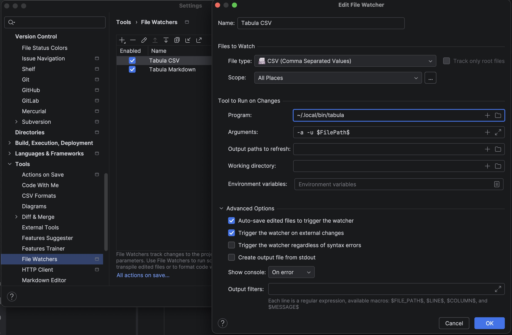
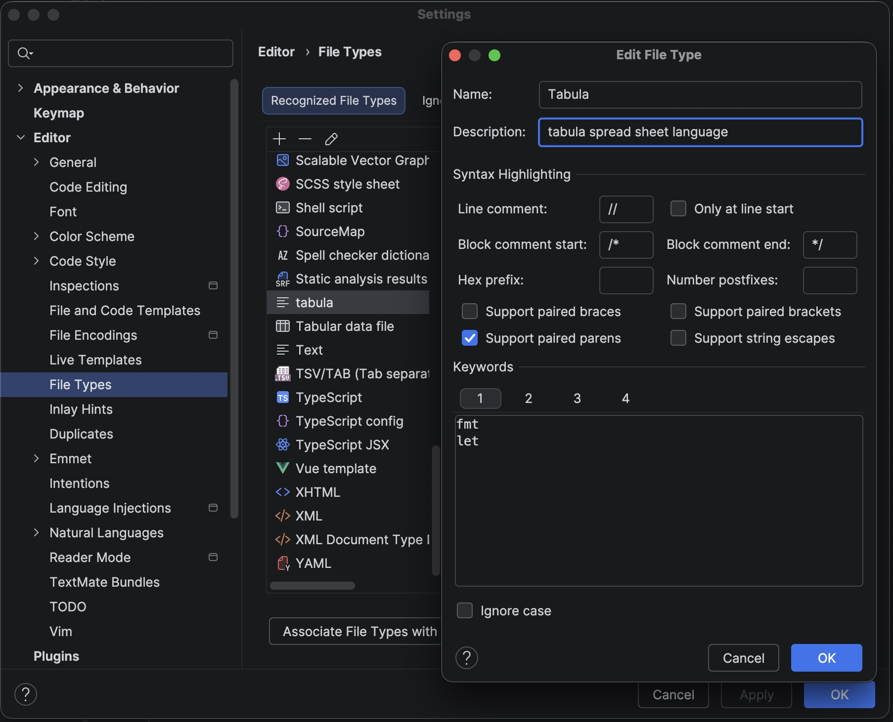

[](https://stand-with-ukraine.pp.ua)

# Tabula for Web Storm

How to use Tabula with **Web Storm**

## Features

- 🔄 **Auto-execution** - Automatically runs Tabula when you save CSV files
- ⚡ **Instant Updates** - See transformations applied immediately after save
- 🔄 **Smart Reload** - Automatically reloads file from disk after transformation
- 🎨 **Syntax Highlighting** - Beautiful syntax coloring for `.tbl` script files
- 📝 **Language Support** - Auto-completion brackets, comments, and code folding for Tabula scripts

## Prerequisites

- **Tabula CLI** must be installed and in your `$PATH`

```bash
# Download from GitHub Pages
curl -LO https://pblazh.github.io/tabula/bin/darwin/arm64/tabula  # macOS M1/M2
chmod +x tabula
sudo mv tabula /usr/local/bin/

```

Or build from source

## Recommended Extensions

For a better CSV editing experience, do recommend installing some extension.

**Why use both?**

- **CSV Extension**: For viewing and editing CSV data in a nice table format
- **Tabula**: For running transformations and scripts on CSV files

These extensions work great together! View your CSV in table mode, make changes, save, and watch Tabula automatically process it.

## Usage

1. Open a CSV file in **Web Storm**
2. Add Tabula script directive:

```csv
#tabula #include "process.tbl"
A,B,C
1,2,3
4,5,6
```
<!-- tabula failed to parse program /Users/pavlo.blazhyievskyi/work/private/tabula/plugins/tabula.webstorm/README.md, failed to parse included file /Users/pavlo.blazhyievskyi/work/private/tabula/plugins/tabula.webstorm/process.tbl include file not found: /Users/pavlo.blazhyievskyi/work/private/tabula/plugins/tabula.webstorm/process.tbl at /Users/pavlo.blazhyievskyi/work/private/tabula/plugins/tabula.webstorm/README.md:1:2 -->


1. Create your Tabula script (`process.tbl`):

```tabula
// Calculate sum
let D1 = "Total";
let D2 = A2 + B2 + C2;
let D3 = A3 + B3 + C3;
```

1. Save the CSV file (Ctrl+S / Cmd+S)
2. Tabula runs automatically and updates the file!

### Configuration

You can configure Web Storm to make working with Tabula more convenient.

### Auto-Execution on Save

Set up an auto execution on file save for `*.csv` and `*.md` files. For Markdown execute **Tabula** with `-m` flag.



## Syntax Highlighting for .tbl Files



### **Supported Elements:**

- **Keywords**: `let`, `fmt`
- **Directive**: `#include`
- **Operators**: `+`, `-`, `*`, `/`, `==`, `!=`, `<`, `>`, `&&`, `||`
- **Numbers**: `42`, `3.14`
- **Strings**: `"text"`, `'text'`
- **Comments**: `// line comment`, `/* block comment */`
- **Functions**: `EXEC`, `SUM`, `ADD`, `PRODUCT`, `AVERAGE`, `MAX`, `MAXA`, `MIN`, `MINA`, `ABS`, `CEILING`, `FLOOR`, `ROUND`, `POWER`, `INT`, `MOD`, `SQRT`, `CONCATENATE`, `LEN`, `LOWER`, `UPPER`, `TRIM`, `EXACT`, `FIND`, `LEFT`, `RIGHT`, `MID`, `SUBSTITUTE`, `VALUE`, `IF`, `NOT`, `AND`, `OR`, `TRUE`, `FALSE`, `TODATE`, `FROMDATE`, `DAY`, `HOUR`, `MINUTE`, `MONTH`, `SECOND`, `YEAR`, `WEEKDAY`, `NOW`, `DATE`, `DATEDIF`, `DAYS`, `DATEVALUE`, `COUNT`, `COUNTA`, `ISNUMBER`, `ISTEXT`, `ISLOGICAL`, `ISBLANK`, `ADDRESS`, `ROW`, `COLUMN`, `REF`, `RANGE`,

## Links

- [Tabula Website](https://pblazh.github.io/tabula)
- [Tabula Documentation](https://github.com/pblazh/tabula/tree/main/doc)
- [GitHub Repository](https://github.com/pblazh/tabula)
- [Report Issues](https://github.com/pblazh/tabula/issues)

## License

[GNU General Public License v3.0](./LICENSE.txt)

## Support

If you find this plugin useful, consider:

- ⭐ Starring the [GitHub repository](https://github.com/pblazh/tabula)
- 🐛 Reporting issues or suggesting features
- 📖 Contributing to the documentation
